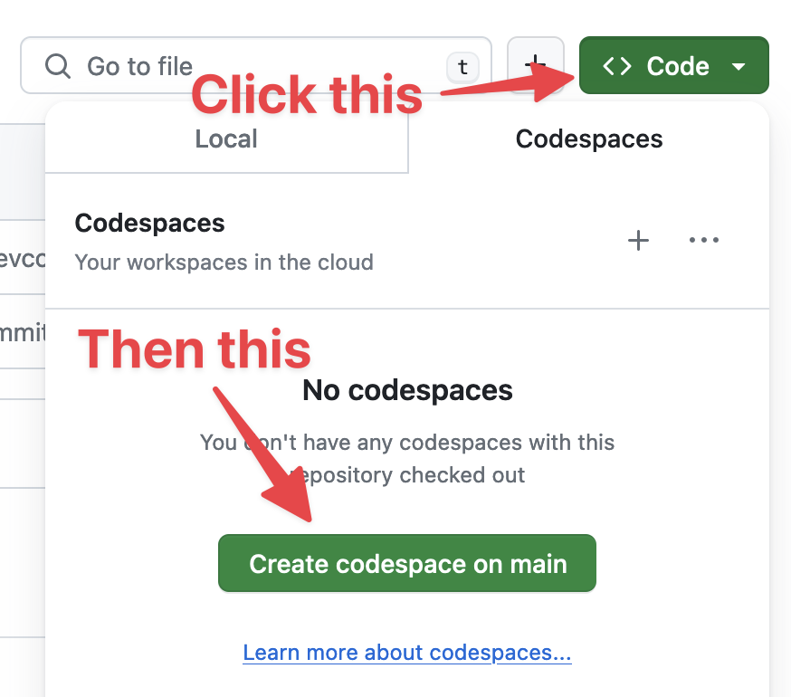
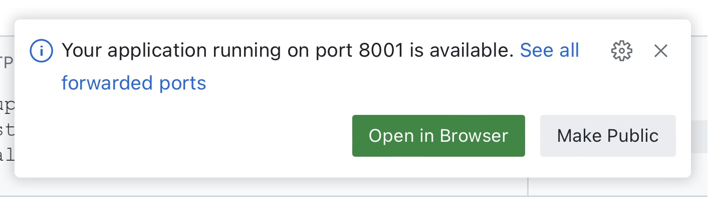

# Datasette Studio

Launch [Datasette Studio](https://github.com/datasette/datasette-studio) - [Datasette](https://datasette.io/) configured with several useful plugins - in a GitHub Codespace.

Then wait for the space to finish booting and click this green "Open in Browser" button to start using Datasette.

